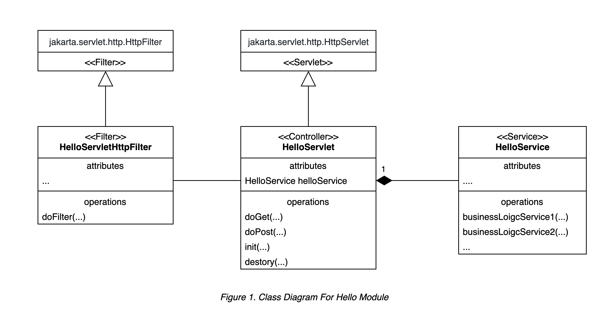
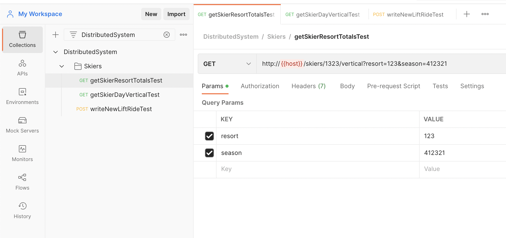
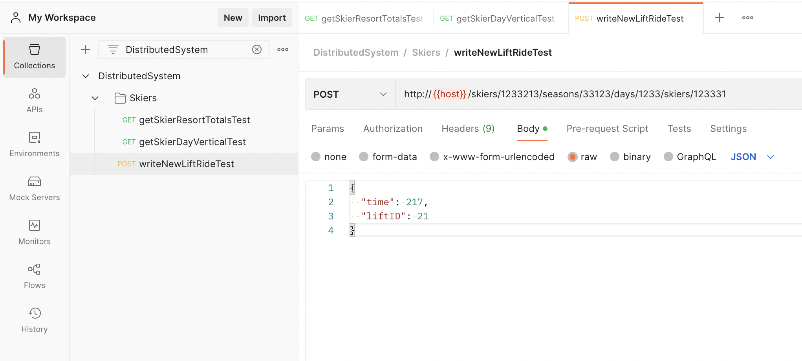

### Recommended Package Architecture

**The structure and class relation, and definition are not mandatory. Students can have their own implementation.**

Suppose we have the business requirement for `Hello` module.

``` bash
├── com                                        
    └── example                                   
        └── distributed_system_server             # project root package        
            ├── controller                        # package for servlet classes
            │   └── HelloServlet.java                 # Servlet for handling `Hello` related HTTP requests.
            ├── service                           # package for service classes
            │   └── HelloService.java                 # Service for handling `Hello` related business logic.
            ├── filter                            # package for HTTP filter classes
            │   └── HelloServletHttpFilter.java       # Servlet for filtering `Hello` related HTTP requests.
            ├── model                             # package for project model (POJO, Bean, etc.) classes
            │   └── Hello.java                        # Java Bean for the `Hello` module.
            ├── constant                          # package for project constant classes
            ├── exception                         # package for project exception classes
            └── util                              # package for project util classes
```

The class diagram will be as follows:



> Note:
>
> - The `HelloServletHttpFilter` is recommended for the incoming HTTP requests filter. It is used for parameter validation, request authentication, logging etc. 
>
>   It is also recommended to use a `MultiReadHttpServletRequest` for reading the incoming HTTP requests' content multiple times while doing the validation of the parameters. The idea is to wrap the incoming `jakarta.servlet.http.HttpServletRequest` to the `MultiReadHttpServletRequest` implemented by us and forwards the wrapped request object to the next level of the filter chain.
>
>   The related issue is here: [Http Servlet request lose params from POST body after read it once](https://stackoverflow.com/questions/10210645/http-servlet-request-lose-params-from-post-body-after-read-it-once).
>
> - The `HelloServlet` handles all valid requests and organizes the parameters to the form that Services needed for business logic. It then further organizes the response and sends it to the front end base on the return values of the service's business function calling.
>
> - The `HelloService` accepts the incoming parameters, performs the business logic, and returns the result of the business operations.


### CMD

#### To develop the project.

``` bash 
mvn jetty:run
```

> The server config for development is at `pom.xml:138`.
>
> Feel free to configure it.


#### To deploy the project.

``` bash
mvn clean install exec:exec
```
> The server config for deployment is in `com.example.distributed_system_server.JettyEmbedding`.
>
> Feel free to configure it.


### Junit Test for API Request Demo

Please refer to test foler: `com.example.dsitributed_system_server.APITest`.


### Test API Request by Postman

#### How To

1. Create a collection for `DistributedSystem` project;
2. Create a folder for `Skier` module;
3. Create requests;

#### The Get Request: `getSkierResortTotalsTest`



#### The Post Request: `writeNewLiftRideTest`

